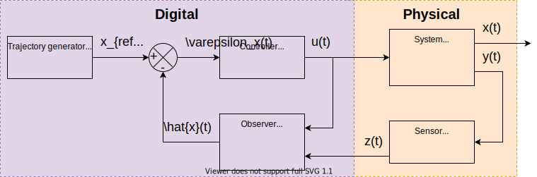

# Simc
Simulation and control environment

### Long term goals

- Provide an environment to test models (written in C++)
- Provide an environment to test observers (written in C++)
- Provide en environment to test control strategies (written in C++)
  - PID
  - Sliding mode control
- Extension based components with different implementations:
  - Integrators
    - RK4
    - Euler
    - Adaptive time-step methods
  - Systems:
    - Inverted pendulum on a cart
    - Brushless DC motor
  - Sensors:
    - Gaussian noise
    - Quantification
    - Delay
  - Observers
    - None (Passthrough)
    - Luenberger
    - Kalman filter
  - Controllers:
    - PID
    - Sliding mode

> The following diagram explains the flow of the information from the digital world with the trajectory generator, controller and observer to the physical world with the system and sensors.

### Working principle

1. Choose an integrator.
2. Choose a model.
3. Configure parameters, initial state, ...
4. (Choose an observer.)
5. Choose a control law.
6. Simulate.
